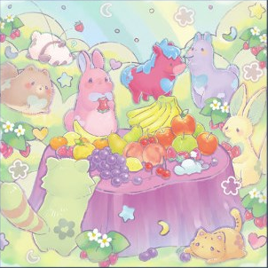
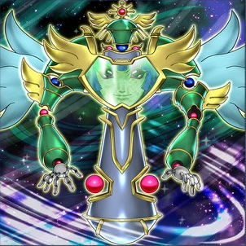
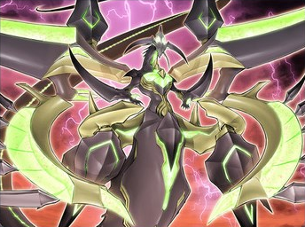
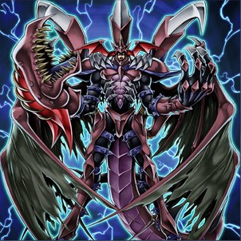
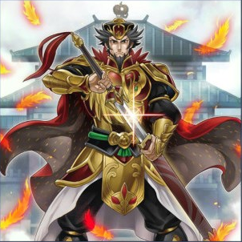
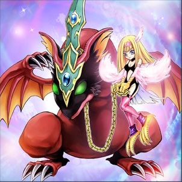

# Deep learning on Monster cards

## Classifier of monsters' race and attribute
```sh
python vgg_monster_classifier.py
```

### Result

#### Accuracy
Model | Race Accuracy | Race Accuracy (Top3) | Attribute Accuracy | Attribute Accuracy (Top3)
:----:|:--------:|:--------------:|:--------:|:--------:
vgg19 | 38.27 % | 63.92 % | 47.46 % | 81.76 %
vgg19+bert | 55.28 % | 79.15 % | 53.36 % | 83.13 %

#### Samples
<table border="0" cellspacing="0" cellpadding="0">
  <tr>
    <td width="128" align="center" valign="middle"><b>卡图</b></td>
    <td width="64" align="center" valign="middle"><b>卡名</b></td>
    <td width="64" align="center" valign="middle"><b>种族</b></td>
    <td width="64" align="center" valign="middle"><b>Top3预测</b></td>
    <td width="64" align="center" valign="middle"><b>属性</b></td>
    <td width="64" align="center" valign="middle"><b>Top3预测</b></td>
  </tr>
  <tr>
    <td width="128"></td>
    <td width="64" align="center" valign="middle">兴奋童话动物家族</td>
    <td width="64" align="center" valign="middle">兽</td>
    <td width="64" align="center" valign="middle"><b>兽</b></br>昆虫</br>植物</td>
    <td width="64" align="center" valign="middle">地</td>
    <td width="64" align="center" valign="middle"><b>地</b></br>风</br>水</td>
  </tr>
  <tr>
    <td width="128"></td>
    <td width="64" align="center" valign="middle">时械神 拉法恩</td>
    <td width="64" align="center" valign="middle">天使</td>
    <td width="64" align="center" valign="middle"><b>天使</b></br>战士</br>兽战士</td>
    <td width="64" align="center" valign="middle">风</td>
    <td width="64" align="center" valign="middle"><b>风</b></br>地</br>光</td>
  </tr>
  <tr>
    <td width="128" align="center" valign="middle"></td>
    <td width="64" align="center" valign="middle">霸王龙 扎克</td>
    <td width="64" align="center" valign="middle">龙</td>
    <td width="64" align="center" valign="middle"><b>龙</b></br>机械</br>电子界</td>
    <td width="64" align="center" valign="middle">暗</td>
    <td width="64" align="center" valign="middle"><b>暗</b></br>光</br>地</td>
  </tr>
  <tr>
    <td width="128"></td>
    <td width="64" align="center" valign="middle">命运英雄 血魔-D</td>
    <td width="64" align="center" valign="middle">战士</td>
    <td width="64" align="center" valign="middle">恶魔</br><b>战士</b></br>机械</td>
    <td width="64" align="center" valign="middle">暗</td>
    <td width="64" align="center" valign="middle"><b>暗</b></br>炎</br>地</td>
  </tr>
  <tr>
    <td width="128"></td>
    <td width="64" align="center" valign="middle">战华之孟-曹德</td>
    <td width="64" align="center" valign="middle">兽战士</td>
    <td width="64" align="center" valign="middle">战士</br><b>兽战士</b></br>电子界</td>
    <td width="64" align="center" valign="middle">炎</td>
    <td width="64" align="center" valign="middle">地</br><b>炎</b></br>光</td>
  </tr>
  <tr>
    <td width="128"></td>
    <td width="64" align="center" valign="middle">鹰身女妖的宠物仔龙</td>
    <td width="64" align="center" valign="middle">龙</td>
    <td width="64" align="center" valign="middle">魔法师</br>不死</br><b>龙</b></td>
    <td width="64" align="center" valign="middle">风</td>
    <td width="64" align="center" valign="middle"><b>风</b></br>暗</br>炎</td>
  </tr>
</table>
